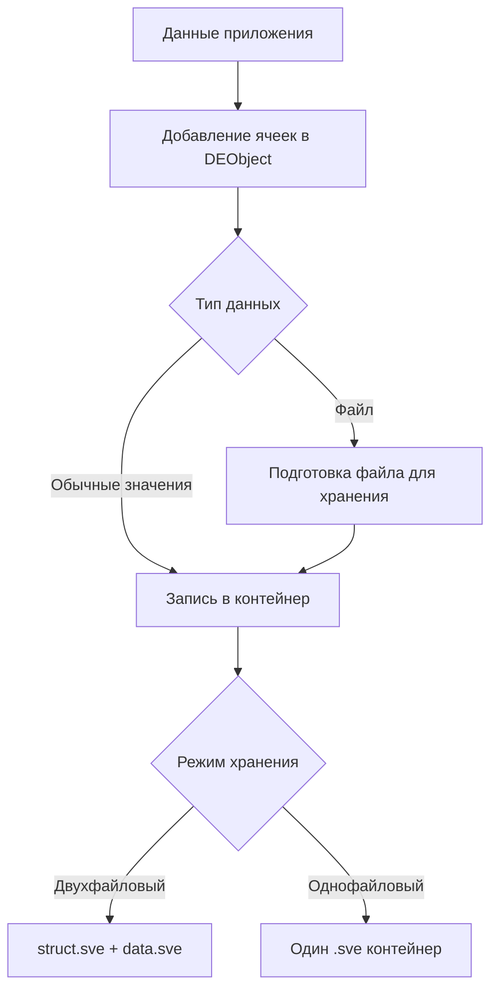

# Сжатие и уменьшение объёма данных

В GDELib 1.4.0 сжатие не выглядит как отдельная пользовательская кнопка или настройка. Библиотека сама применяет подходящие способы упаковки данных в рамках своего формата хранения.

## Что важно понимать простыми словами

В версии `1.4.0` библиотека уменьшает объём данных в двух наиболее заметных сценариях:

- при работе с файловыми ячейками;
- при компактной записи данных в однофайловом режиме.

Это не универсальный архиватор для любых данных, а встроенная логика формата SVE.

## Файлы внутри контейнера

Когда в контейнер добавляется файловая ячейка, библиотека работает не только с путём, а с самим файлом.

На практике это означает:

1. приложение передаёт путь к исходному файлу;
2. библиотека упаковывает файл для хранения внутри контейнера;
3. при чтении библиотека восстанавливает копию файла в кэш-папку.

Для пользователя это удобно тем, что контейнер переносит сам ресурс вместе с данными.

## Однофайловый режим

Однофайловый режим решает ещё одну задачу: упрощает хранение структуры и данных за счёт одного основного контейнера.

В прикладном смысле это даёт:

- меньше основных файлов на диске;
- удобство передачи одного контейнера;
- более компактный сценарий сохранения для части наборов данных.

## Что влияет на итоговый размер

На размер контейнера сильнее всего влияют:

- количество ячеек;
- объём строковых данных;
- наличие файловых вложений;
- выбранный режим хранения;
- характер данных: короткие, длинные, повторяющиеся или разнообразные значения.

## Когда можно ожидать лучший результат

Практически больший выигрыш чаще заметен в двух ситуациях:

- когда вместе с данными сохраняются файлы;
- когда проекту подходит однофайловый режим и нужен один основной контейнер.

## Упрощённый pipeline



## Псевдокод

```text
создать DEObject
добавить значения через CreateCell(...)
если значение является файлом:
    сохранить файл внутри контейнера
сохранить контейнер через Save()
если нужен один основной файл:
    использовать однофайловый режим
```

## Что измерять в benchmark

Так как универсальных цифр для всех наборов данных нет, разумно мерить свой сценарий отдельно.

Минимальный набор метрик:

- размер контейнера после `Save()`;
- время `Save()`;
- время `OpenAll()`;
- разницу между двухфайловым и однофайловым режимом;
- влияние файловых вложений.

## Benchmark-план

### Сценарии

| Сценарий | Что проверяет |
| --- | --- |
| `Scalar.Small` | Небольшой набор `int`, `double`, `string`, `bool` |
| `Scalar.Large` | Большой набор типовых ячеек |
| `Files.Small` | Контейнер с небольшими файлами |
| `Files.Mixed` | Контейнер с несколькими файлами разного размера |
| `OneFile vs TwoFile` | Разница между режимами хранения |

### Какие графики строить

- размер контейнера по сценариям;
- время сохранения по сценариям;
- время чтения по сценариям;
- сравнение однофайлового и двухфайлового режима.

## C#-каркас benchmark

```csharp
using System;
using System.Diagnostics;
using System.Globalization;
using System.IO;
using GDELib;

internal static class Program
{
    private static void Main()
    {
        Run("TwoFile", false);
        Run("OneFile", true);
    }

    private static void Run(string scenarioName, bool oneFile)
    {
        string root = Path.Combine(Environment.CurrentDirectory, "bench-" + scenarioName);
        Directory.CreateDirectory(root);

        var de = new DEObject(root, oneFile, "data.sve", "struct.sve", root);

        for (int i = 0; i < 1000; i++)
        {
            de.CreateCell("int", i);
            de.CreateCell("double", i * 0.5);
            de.CreateCell("string", "value_" + i);
            de.CreateCell("bool", i % 2 == 0);
        }

        var sw = Stopwatch.StartNew();
        de.Save();
        sw.Stop();
        double saveMs = sw.Elapsed.TotalMilliseconds;

        sw.Restart();
        string[] values = de.OpenAll();
        sw.Stop();
        double openAllMs = sw.Elapsed.TotalMilliseconds;

        long totalBytes = 0;
        foreach (string file in Directory.EnumerateFiles(root, "*", SearchOption.TopDirectoryOnly))
        {
            totalBytes += new FileInfo(file).Length;
        }

        Console.WriteLine(string.Join(";",
            scenarioName,
            oneFile,
            values.Length,
            totalBytes.ToString(CultureInfo.InvariantCulture),
            saveMs.ToString(CultureInfo.InvariantCulture),
            openAllMs.ToString(CultureInfo.InvariantCulture)));
    }
}
```

## Шаблон таблицы результатов

| Scenario | OneFile | Values | TotalBytes | SaveMs | OpenAllMs |
| --- | --- | --- | --- | --- | --- |
| TwoFile | false |  |  |  |  |
| OneFile | true |  |  |  |  |
| Files.Small | false |  |  |  |  |
| Files.Small | true |  |  |  |  |

## Что ещё полезно измерить

- размер контейнера при добавлении файлов разного размера;
- разницу между использованием одного и нескольких файловых ресурсов;
- поведение контейнера в типичном для вашего проекта наборе данных.
