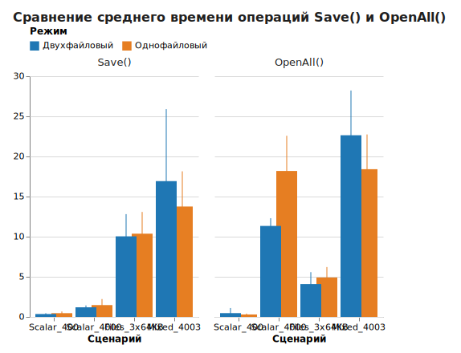
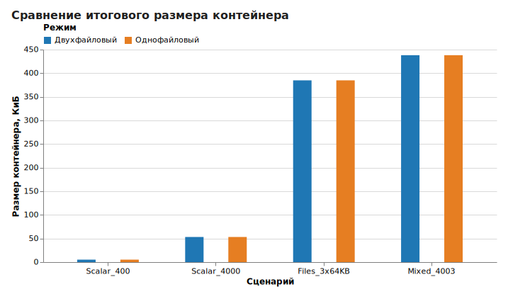
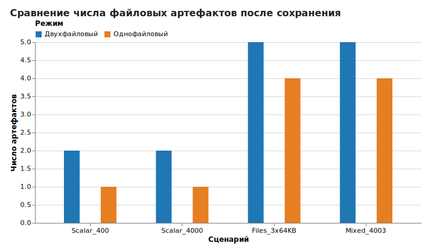

# Упаковка данных и результаты измерений

## Что это и зачем нужно

В `GDELib 1.4.0` пользователь не управляет сжатием отдельной командой. Библиотека самостоятельно размещает данные внутри формата SVE, а разработчик работает с итоговым контейнером через `DEObject`. На практике это означает, что для прикладного использования важны три вопроса:

- какие данные попадают в контейнер;
- как на результат влияет однофайловый и двухфайловый режим;
- каков фактический объём контейнера и время операций `Save()` и `OpenAll()` на конкретном стенде.

Настоящий документ фиксирует именно пользовательский аспект: как библиотека ведёт себя при записи и чтении данных, а также какие результаты были получены при контрольных испытаниях версии `1.4.0`.

## Общие положения

Для скалярных типов `int`, `double`, `string` и `bool` библиотека сохраняет значения во внутреннем контейнере и затем возвращает их в строковом виде через `OpenAll()` или `OpenNext(...)`.

Для файловых ячеек логика иная:

1. в `CreateCell("file", path)` передаётся путь к исходному файлу;
2. библиотека сохраняет содержимое файла в контейнере;
3. при чтении библиотека возвращает путь к восстановленной копии файла.

Следовательно, файловая ячейка предназначена не для хранения ссылки на внешний путь, а для переноса самого ресурса вместе с данными контейнера.

## Методика испытаний

Для оценки времени записи, времени полного чтения и размера контейнера был подготовлен отдельный проект `benchmarks/GDELib.Benchmarks`, использующий опубликованную DLL `GDELib 1.4.0` из NuGet-пакета.

В таблице 1 приведены параметры испытательного стенда.

Таблица 1 - Конфигурация испытательного стенда

| Параметр | Значение |
| --- | --- |
| Процессор | Intel Core i5-1135G7, 4 ядра, 8 потоков |
| Графический адаптер | NVIDIA GeForce MX350 |
| Операционная система | Ubuntu 22.04 под WSL2 |
| Ядро | Linux 6.6.87.2-microsoft-standard-WSL2 |
| .NET SDK | 6.0.428 |
| .NET Runtime | 6.0.36 |
| Число прогревочных запусков | 2 |
| Число зачётных измерений | 8 |

Графический адаптер в вычислениях не использовался напрямую, так как библиотека выполняет операции сериализации, файлового ввода-вывода и восстановления данных на стороне CPU и файловой подсистемы.

На рисунке 1 представлена схема проведения измерений.


Рисунок 1 - Схема проведения контрольных испытаний

В таблице 2 представлены сценарии, использованные при измерениях.

Таблица 2 - Сценарии контрольных испытаний

| Обозначение | Состав набора данных | Ожидаемое число значений |
| --- | --- | ---: |
| `Scalar_400` | 100 наборов `int`, `double`, `string`, `bool` | 400 |
| `Scalar_4000` | 1000 наборов `int`, `double`, `string`, `bool` | 4000 |
| `Files_3x64KB` | 3 файловые ячейки по 64 КиБ | 3 |
| `Mixed_4003` | 1000 скалярных наборов и 3 файловые ячейки по 64 КиБ | 4003 |

Для файловых сценариев использовались детерминированные псевдослучайные бинарные файлы. Такой подход позволил избежать искусственно завышенного эффекта сжатия на однотипных данных.

## Результаты измерений

В таблице 3 представлены усреднённые результаты восьми зачётных измерений. Для оценки разброса указано стандартное отклонение.

Таблица 3 - Время выполнения операций `Save()` и `OpenAll()`

| Сценарий | Режим | Среднее время `Save()`, мс | Среднее время `OpenAll()`, мс | Стандартное отклонение `Save()`, мс | Стандартное отклонение `OpenAll()`, мс |
| --- | --- | ---: | ---: | ---: | ---: |
| `Scalar_400` | Двухфайловый | 0.358 | 0.472 | 0.095 | 0.592 |
| `Scalar_400` | Однофайловый | 0.467 | 0.301 | 0.197 | 0.103 |
| `Scalar_4000` | Двухфайловый | 1.197 | 11.339 | 0.218 | 0.902 |
| `Scalar_4000` | Однофайловый | 1.473 | 18.190 | 0.701 | 4.103 |
| `Files_3x64KB` | Двухфайловый | 10.042 | 4.091 | 2.589 | 1.388 |
| `Files_3x64KB` | Однофайловый | 10.373 | 4.912 | 2.534 | 1.218 |
| `Mixed_4003` | Двухфайловый | 16.924 | 22.642 | 8.388 | 5.218 |
| `Mixed_4003` | Однофайловый | 13.759 | 18.409 | 4.104 | 4.053 |

В таблице 4 приведены размеры полученных контейнеров и число файловых артефактов, сформированных библиотекой после сохранения.

Таблица 4 - Размер контейнера и число служебных артефактов

| Сценарий | Режим | Размер, байт | Размер, КиБ | Число артефактов |
| --- | --- | ---: | ---: | ---: |
| `Scalar_400` | Двухфайловый | 5354 | 5.23 | 2 |
| `Scalar_400` | Однофайловый | 5366 | 5.24 | 1 |
| `Scalar_4000` | Двухфайловый | 54504 | 53.23 | 2 |
| `Scalar_4000` | Однофайловый | 54516 | 53.24 | 1 |
| `Files_3x64KB` | Двухфайловый | 394090 | 384.85 | 5 |
| `Files_3x64KB` | Однофайловый | 394102 | 384.87 | 4 |
| `Mixed_4003` | Двухфайловый | 448590 | 438.08 | 5 |
| `Mixed_4003` | Однофайловый | 448602 | 438.09 | 4 |

## Графическое представление результатов

Графики, приведённые в данном разделе, построены с использованием библиотеки `Altair 6.0.0` по данным из файла `gdelib-1.4.0-benchmark-raw.csv`.

На рисунке 2 представлено сравнение среднего времени операций `Save()` и `OpenAll()` для всех исследованных сценариев. Вертикальные отрезки показывают стандартное отклонение относительно среднего значения.



Рисунок 2 - Сравнение среднего времени операций `Save()` и `OpenAll()`

По рисунку 2 видно, что различие между режимами для малого скалярного набора несущественно. При увеличении числа скалярных значений преимущество по полному чтению на данном стенде переходит к двухфайловому режиму. Для смешанного сценария, напротив, более выгодные средние значения наблюдаются у однофайлового режима.

На рисунке 3 представлено сравнение итогового размера контейнера.



Рисунок 3 - Сравнение итогового размера контейнера

По рисунку 3 можно установить, что размер контейнера практически не зависит от выбранного режима хранения. Во всех рассмотренных сценариях различие между однофайловым и двухфайловым вариантом не имеет существенного практического значения.

На рисунке 4 представлено сравнение числа файловых артефактов, создаваемых библиотекой после сохранения.



Рисунок 4 - Сравнение числа файловых артефактов после сохранения

По рисунку 4 видно, что однофайловый режим систематически оставляет меньше файловых объектов. Следовательно, выбор однофайлового режима оправдан тогда, когда для проекта важны компактная организация файлов на диске и наличие одного основного контейнера.

## Интерпретация результатов

По данным таблицы 3 можно сделать несколько практических выводов.

Во-первых, для малого скалярного набора (`Scalar_400`) различия между режимами носят очень небольшой характер. Абсолютные времена находятся в пределах долей миллисекунды, поэтому такой сценарий не следует использовать для выбора архитектуры хранения.

Во-вторых, при росте числа скалярных значений до 4000 двухфайловый режим на данном стенде показал более быстрое полное чтение. Разница по `OpenAll()` составила примерно `6.85` мс в пользу двухфайлового варианта.

В-третьих, при файловом сценарии `Files_3x64KB` время записи в обоих режимах оказалось близким, тогда как чтение в двухфайловом режиме было несколько быстрее. При этом разница по размеру контейнера между режимами составила только `12` байт.

В-четвёртых, в смешанном сценарии `Mixed_4003` однофайловый режим на данном стенде продемонстрировал более короткое среднее время записи и полного чтения. Однако стандартное отклонение для обеих конфигураций остаётся заметным, поэтому результаты следует трактовать как эмпирические для рассматриваемой среды, а не как универсальное правило.

По данным таблицы 4 можно установить устойчивую закономерность: однофайловый режим уменьшает число создаваемых артефактов на единицу, но практически не меняет общий объём контейнера. Следовательно, выбор режима в `GDELib 1.4.0` следует делать прежде всего исходя из удобства хранения и обмена файлами, а не из ожидания крупного выигрыша по размеру.

## Практическое применение результатов

Если проекту требуется один основной пользовательский файл, однофайловый режим остаётся предпочтительным по организационным причинам. Если же приоритетом является предсказуемое чтение крупных скалярных наборов, на этом стенде двухфайловый режим показал более выгодный результат.

Для сценариев с вложенными файлами целесообразно проверять данные именно на типовом наборе приложения. Измерения показали, что влияние режима на итоговый размер контейнера невелико, тогда как время чтения и записи зависит от состава данных и среды выполнения.

## Воспроизведение результатов

Повторный запуск измерений выполняется командой:

```bash
/home/mikidev/.local-dotnet/dotnet run --project benchmarks/GDELib.Benchmarks/GDELib.Benchmarks.csproj -c Release
```

Генерация графиков по уже полученным данным выполняется командами:

```bash
python3 -m pip install --user -r benchmarks/requirements-altair.txt
python3 benchmarks/generate_altair_charts.py
```

Сырые результаты сохранены в файлах:

- [benchmarks/results/gdelib-1.4.0-benchmark-raw.csv](/home/mikidev/projects/GDELib/benchmarks/results/gdelib-1.4.0-benchmark-raw.csv)
- [benchmarks/results/gdelib-1.4.0-benchmark-summary.md](/home/mikidev/projects/GDELib/benchmarks/results/gdelib-1.4.0-benchmark-summary.md)
- [benchmarks/results/gdelib-1.4.0-benchmark-dashboard.html](/home/mikidev/projects/GDELib/benchmarks/results/gdelib-1.4.0-benchmark-dashboard.html)
- [benchmarks/generate_altair_charts.py](/home/mikidev/projects/GDELib/benchmarks/generate_altair_charts.py)
