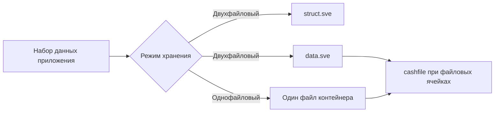

# Формат хранения данных в GDELib 1.4.0

## Что это и зачем нужно

Формат SVE в `GDELib 1.4.0` предназначен для хранения набора данных приложения в файловом контейнере. Для пользователя библиотеки важно понимать не внутренние детали реализации, а прикладную модель:

- какие типы данных можно записывать;
- какие файлы создаются на диске;
- чем отличается однофайловый режим от двухфайлового;
- как ведут себя файловые ячейки при чтении.

Настоящий документ описывает формат хранения именно в этом прикладном смысле.

## Общая модель хранения

`GDELib 1.4.0` разделяет хранение данных на две логические части:

1. описание структуры набора;
2. сами значения.

В зависимости от выбранного режима эти части могут быть размещены либо в двух отдельных файлах, либо в одном общем контейнере.

В таблице 1 представлены пользовательские типы данных, поддерживаемые библиотекой.

Таблица 1 - Типы данных, поддерживаемые `GDELib 1.4.0`

| Тип | Как передаётся в API | Что получает пользователь при чтении |
| --- | --- | --- |
| `int` | `CreateCell("int", value)` | Строковое представление числа |
| `double` | `CreateCell("double", value)` | Строковое представление числа |
| `string` | `CreateCell("string", value)` | Исходная строка |
| `bool` | `CreateCell("bool", value)` | Строковое представление логического значения |
| `file` | `CreateCell("file", path)` | Путь к восстановленной копии файла |

## Двухфайловый режим

Двухфайловый режим является базовым режимом работы библиотеки. В этом случае структура и данные размещаются раздельно.

В таблице 2 приведён состав объектов, которые обычно появляются на диске после сохранения.

Таблица 2 - Объекты двухфайлового режима

| Объект | Назначение |
| --- | --- |
| `struct.sve` | Хранение структуры контейнера |
| `data.sve` | Хранение значений |
| `cashfile` | Вспомогательная папка для работы с файловыми ячейками |

Для разработчика это означает, что после `Save()` в рабочей папке остаются отдельные файлы структуры и данных. Такой режим удобен, когда требуется наглядно отделить описание контейнера от его содержимого.

## Однофайловый режим

Однофайловый режим включается через параметр `_TOne = true` в конструкторе `DEObject`.

В этом случае библиотека формирует один основной файл контейнера, имя которого определяется параметром `_NameData`. На практике это может быть `data.sve`, `bundle.sve` или иное имя, переданное в конструктор.

Однофайловый режим удобен в сценариях, где пользователю приложения нужен один основной файл сохранения, передачи или резервного копирования.

На рисунке 1 представлена логическая схема организации данных в обоих режимах.



Рисунок 1 - Логическая схема размещения данных в форматах хранения `GDELib`

## Файловые ячейки

Файловая ячейка в `GDELib 1.4.0` хранит не только путь к исходному файлу, а сам файл как часть контейнера. Поэтому типовой цикл работы выглядит следующим образом:

1. приложение передаёт путь к исходному файлу;
2. библиотека сохраняет содержимое файла в контейнере;
3. при чтении библиотека восстанавливает копию файла;
4. метод `OpenAll()` или `OpenNext(...)` возвращает путь к этой копии.

Такой подход позволяет переносить вместе с контейнером не только значения, но и связанные с ними ресурсы.

## Что пользователь видит при чтении

Для обычных типов методы `OpenAll()` и `OpenNext(...)` возвращают строковые значения.

Для файловых ячеек возвращается путь к восстановленному файлу. Ниже приведён минимальный пример такого чтения:

```csharp
string[] values = de.OpenAll();
string restoredFilePath = values[0];
Console.WriteLine(restoredFilePath);
```

Следовательно, после чтения файловой ячейки прикладной код должен работать уже с возвращённым путём, а не с исходным расположением файла, использованным при записи.

## Практические рекомендации по выбору режима

В таблице 3 приведены критерии выбора режима хранения.

Таблица 3 - Практический выбор режима хранения

| Ситуация | Рекомендуемый режим |
| --- | --- |
| Требуется один основной пользовательский файл | Однофайловый |
| Требуется явное разделение структуры и данных | Двухфайловый |
| Нужна простая стартовая интеграция и понятная файловая структура | Двухфайловый |
| Требуется передавать контейнер как единый объект | Однофайловый |

Таким образом, выбор режима определяется прежде всего способом эксплуатации контейнера, а не различием в составе пользовательских данных.

## Совместимость и эксплуатационные замечания

Для прикладного использования рекомендуется открывать контейнеры той же версией библиотеки, которой они были созданы, либо версией, проверенной на совместимость в рамках проекта.

Если данные были записаны в определённом режиме, в рабочем коде целесообразно сохранять тот же режим и при последующем чтении. Такой подход упрощает эксплуатацию и снижает вероятность ошибок конфигурации.

## Краткий вывод

Формат хранения `GDELib 1.4.0` предоставляет две организационные модели работы с одним и тем же набором данных: двухфайловую и однофайловую. Для конечного пользователя библиотеки это означает простой выбор между наглядной файловой структурой и единым контейнером без изменения основного API работы с `DEObject`.
