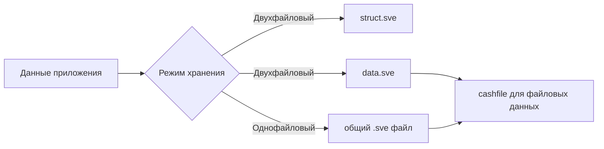

# Формат хранения данных в GDELib 1.4.0

Этот документ объясняет, как библиотека GDELib 1.4.0 организует хранение данных в формате SVE.

## Общая идея формата

GDELib хранит данные в контейнере, который состоит из двух логических частей:

- описание структуры набора;
- сами значения.

В зависимости от режима эти части могут лежать:

- в двух отдельных файлах;
- в одном общем файле.

## Поддерживаемые данные

В версии `1.4.0` в контейнер можно сохранять:

- `int`
- `double`
- `string`
- `bool`
- файлы

## Двухфайловый режим

Это базовый режим работы библиотеки.

### Что создаётся

По умолчанию на диске появляются:

- `struct.sve`
- `data.sve`
- `cashfile`

### Как это понимать

- `struct.sve` содержит служебную информацию о составе контейнера;
- `data.sve` хранит значения;
- `cashfile` используется для работы с файлами, которые были сохранены внутри контейнера.

### Когда выбирать такой режим

- когда удобно видеть структуру и данные раздельно;
- когда проекту не требуется единый файл-контейнер;
- когда хочется более явной организации сохранений на диске.

## Однофайловый режим

Однофайловый режим включается параметром `_TOne = true`.

### Что создаётся

На диске остаётся один основной контейнер, например:

- `data.sve`
- `bundle.sve`

Имя зависит от параметра `_NameData`.

### Когда выбирать такой режим

- когда нужен один основной файл сохранения;
- когда так удобнее распространять или копировать контейнер;
- когда приложение должно работать с одним пользовательским файлом данных.

## Схема двух режимов



## Как библиотека хранит файлы

Важный момент для пользовательской документации версии `1.4.0`:

- в `CreateCell("file", path)` передаётся путь к исходному файлу;
- в контейнер сохраняется сам файл;
- при чтении библиотека возвращает путь к восстановленной копии файла в кэш-папке.

Это значит, что файловая ячейка — это способ хранить ресурс внутри контейнера, а не просто помнить ссылку на исходный путь.

## Что пользователь видит при чтении

### Для обычных значений

`OpenAll()` и `OpenNext(...)` возвращают строковые представления значений.

### Для файлов

При чтении файловой ячейки пользователь получает путь к восстановленной копии файла.

Пример:

```csharp
string[] values = de.OpenAll();
string restoredFilePath = values[0];
```

## Актуальная структура файла для 1.4.0

Для практического использования достаточно помнить следующую модель:

### Двухфайловый вариант

1. библиотека записывает описание набора;
2. библиотека записывает данные;
3. при наличии файлов использует кэш-папку для упаковки и восстановления.

### Однофайловый вариант

1. библиотека записывает служебную часть и данные в один контейнер;
2. при чтении библиотека разбирает этот контейнер как единый файл.

## Совместимость при работе с файлами

Для прикладного использования стоит придерживаться простого правила:

- сохранять и открывать контейнеры одной и той же версией библиотеки или версией, совместимой с релизом `1.4.0`.

В рамках одного проекта также важно соблюдать единый режим:

- если данные записаны в двухфайловом режиме, открывать их лучше так же;
- если данные записаны в однофайловом режиме, читать их удобнее в том же режиме.

## Что важно знать конечному пользователю

- Двухфайловый и однофайловый режимы решают одну задачу, но по-разному организуют данные на диске.
- Файловые ячейки хранят содержимое файла внутри контейнера.
- Для чтения можно использовать как тот же экземпляр `DEObject`, так и новый.
- Если нужна простая и понятная структура сохранения, чаще начинают с двухфайлового режима.
