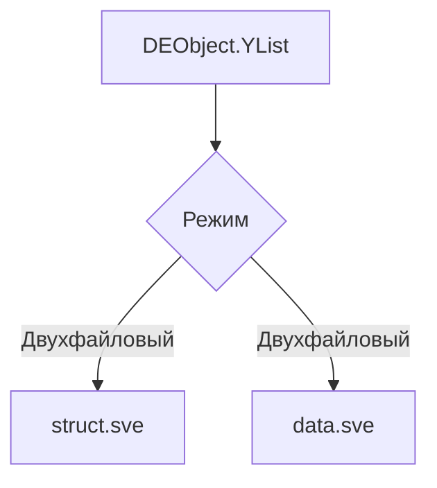
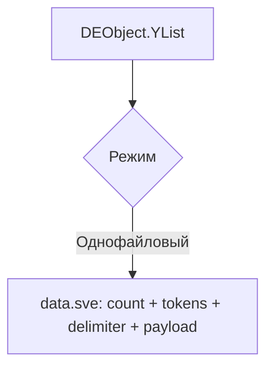
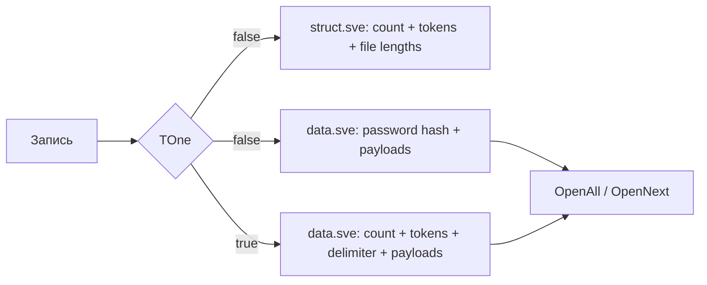

# Формат хранения данных

Этот документ описывает, как GDELib укладывает данные на диск. Сначала — простое объяснение, затем техническая структура байтов и маркеров.

## Формат простыми словами

У библиотеки есть два базовых режима:

- **двухфайловый**: структура лежит отдельно от полезных данных;
- **однофайловый**: структура и данные записываются в один поток.

Кроме этого, у библиотеки есть специальный формат хранения матриц `int[,]` и отдельная логика упаковки файловых вложений через zip.

## Подтверждённые источники для этого документа

- текущая реализация `DEObject` и `DESaver`; `[confirmed by code]`
- текущая реализация `DESMini`/`MatrixIndexStorage`; `[confirmed by code]`
- git diff между `5046716` (`GDELib 1.4`) и `b100d5b` (`GDELib 1.5 Preview 2`). `[confirmed by git history]`

## Поддерживаемые типы данных

| Пользовательский тип | Внутренний enum | Токен в текущем коде | Legacy-токен, который ещё читается | Где хранится payload |
| --- | --- | --- | --- | --- |
| `int` | `integer` | `"i"` | `"integer"` | `Int32` |
| `double` | `doubl` | `"d"` | `"doubl"` | `Double` |
| `string` | `str` | `"s"` | `"str"` | строка `BinaryWriter` |
| `bool` | `booling` | `"b"` | `"booling"` | строка `"True"` / `"False"` |
| `file` | `files` | `"f"` | `"files"` | zip-байты одного файла |
| `int[,]` | `mas` | `"m"` | `"mas"` | матричный блок `DESMini` |
| серия `int` в однофайловом режиме | не отдельный пользовательский тип | `"l"` | нет | матрица `N x 1`, используемая как блок сжатия |

`"l"` не является отдельным типом API. Это внутренний маркер однофайлового режима для сжатой серии целых чисел. `[confirmed by code]`

## Двухфайловый режим

### Что это означает

В двухфайловом режиме структура и данные хранятся раздельно:

- `struct.sve` — описание состава набора;
- `data.sve` — сами значения.

Это даёт более явную организацию формата и позволяет хранить часть служебной информации отдельно.

### Схема верхнего уровня



### Техническая структура `struct.sve`

| Порядок | Поле | Тип записи | Комментарий |
| --- | --- | --- | --- |
| 1 | количество ячеек | `UInt32` при записи, `Int32` при чтении | Число пользовательских ячеек |
| 2 | опциональный маркер пароля | строка `"p"` | Пишется только если пароль задан |
| 3..N | токены типов | строки `"i"`, `"d"`, `"s"`, `"b"`, `"f"`, `"m"` | Для каждого элемента по порядку |
| рядом с `"f"` | длина zip-блока | `Int32` | Хранится в `struct.sve`, не в `data.sve` |

### Техническая структура `data.sve`

| Порядок | Поле | Тип записи | Комментарий |
| --- | --- | --- | --- |
| 1 | опциональный SHA-256-хэш пароля | строка | Пишется только если задан пароль |
| далее | значения в порядке токенов | разные | `Int32`, `Double`, строка, zip-байты, матричный блок |

### Важная деталь по типам

Строки и `bool` хранятся через `BinaryWriter.Write(string)`. Это означает стандартное строковое представление .NET `BinaryWriter`, а не пользовательский формат строк. `[inferred from implementation]`

### Что происходит с файловой ячейкой

1. Библиотека берёт файл по пути из ячейки.
2. Создаёт zip-архив с одной записью.
3. Длину zip-архива пишет в `struct.sve`.
4. Байты архива пишет в `data.sve`.
5. При чтении архив распаковывается в папку кэша `cashfile`. `[confirmed by code]`

## Однофайловый режим

### Что это означает

В однофайловом режиме вся информация лежит внутри `data.sve`. Формат делится на две логические части:

- секция структуры;
- секция данных.

### Схема верхнего уровня



### Техническая структура `data.sve` в однофайловом режиме

| Порядок | Поле | Тип записи | Комментарий |
| --- | --- | --- | --- |
| 1 | количество ячеек | `UInt32` | Число пользовательских ячеек |
| 2 | опциональный маркер пароля | строка `"p"` | Если пароль задан |
| 3..N | токены типов | строки | `"i"`, `"d"`, `"s"`, `"b"`, `"f"`, `"m"` или `"l"` |
| рядом с `"l"` | длина серии | `Int32` | Число подряд идущих `int`, сжатых как блок |
| далее | разделитель структуры и данных | строка `"/"` | Reader также принимает старый разделитель `"-/-/-/-/-/-"` |
| далее | опциональный SHA-256-хэш пароля | строка | Пишется перед полезной нагрузкой |
| далее | payload секции данных | разные | Значения по очереди, включая матричные блоки |

### Зачем нужен токен `"l"`

Если библиотека видит подряд не меньше пяти `int`, она не пишет их как пять отдельных `Int32`, а заменяет серию на один служебный маркер `"l"` и сохраняет саму серию через матричный блок размера `N x 1`. `[confirmed by code]`

Это не новый пользовательский тип данных, а внутренняя оптимизация однофайлового режима.

## Матрицы и новый вложенный формат

### Что происходит на уровне пользователя

Пользователь вызывает:

```csharp
de.CreateCell(matrix);
```

При чтении получает:

```csharp
string marker = de.OpenAll()[index]; // например "matrix_2"
int[,] matrix = de.MatrixData(marker);
```

### Что происходит внутри формата

Матрица сериализуется отдельным бинарным блоком `DESMini`, который:

- выбирает один из двух вариантов индексации;
- строит таблицу часто встречающихся последовательностей;
- использует trie и nibble-упаковку;
- может применять смещения `int` и `byte`;
- завершает блок маркером `FF 00 FF`. `[confirmed by code]`

Полный pipeline описан в [Compression.md](Compression.md).

## Новая структура файла относительно `1.4`

Сравнение основано на diff между:

- `old_ref = 5046716` — коммит `GDELib 1.4`
- `new_ref = b100d5b` — коммит `GDELib 1.5 Preview 2`

### Что изменилось

| Область | Было в `1.4` | Есть в текущем коде | Статус |
| --- | --- | --- | --- |
| Токены типов | Полные строки: `integer`, `doubl`, `str`, `booling`, `files` | Короткие токены: `i`, `d`, `s`, `b`, `f`, `m` | `confirmed by code` |
| Пароль | Нет | Маркер `"p"` + хэш в data section | `confirmed by code` |
| Матрицы | Нет | Токен `"m"` + блок `DESMini` | `confirmed by code` |
| Сжатые серии `int` в one-file | Нет | Токен `"l"` + длина серии + матричный блок | `confirmed by code` |
| Разделитель one-file | `"-/-/-/-/-/-"` | `"/"`; reader принимает оба варианта | `confirmed by code` |

## Совместимость версий

### Что текущий код умеет читать

- старые строковые токены типов `integer`, `doubl`, `str`, `booling`, `files`; `[confirmed by code]`
- новые короткие токены `i`, `d`, `s`, `b`, `f`, `m`; `[confirmed by code]`
- старый и новый разделители однофайлового режима. `[confirmed by code]`

### Что старый код `1.4` читать не обязан

С высокой вероятностью код `1.4` не сможет корректно прочитать файлы, записанные текущим кодом, потому что он:

- не знает токены `"i"`, `"d"`, `"s"`, `"b"`, `"f"`, `"m"`;
- не знает маркер `"p"`;
- не знает маркер `"l"`;
- не знает матричный блок `DESMini`. `[confirmed by code]`

Это **one-way compatibility**: новый reader читает старый формат лучше, чем старый reader читает новый.

## Риски несовместимости и ограничения

- У верхнеуровневого формата нет явного общего version-header для `data.sve` и `struct.sve`. Совместимость поддерживается в основном через условные ветки reader-а. `[confirmed by code]`
- Матричный блок завершается сигнатурой `FF 00 FF`, а не длиной блока. Если такая последовательность встретится внутри полезной нагрузки, возможна неоднозначность. `[confirmed by code]`
- В двухфайловом режиме длина файла-вложения хранится в `struct.sve`, а байты — в `data.sve`. Для ручного разбора формата это критично.
- Булевы значения хранятся строкой, а не отдельным бинарным флагом.

## Что важно знать конечному пользователю

- Если вам нужна совместимость со старым форматом `1.4`, не смешивайте старый и новый writer без отдельной миграции.
- Если вы используете матрицы, ориентируйтесь на текущий код репозитория, а не только на опубликованный NuGet `1.4.0`. `[confirmed by git history]`
- Для ручной диагностики полезно помнить: `OpenAll()` возвращает строковые значения, а матрицы нужно извлекать отдельно.

## Краткая схема двух режимов



## Что ещё нужно проверять вручную

- Поведение старых опубликованных DLL при чтении файлов новой ветки. `[needs verification]`
- Реальную кроссплатформенность путей к папке кэша, потому что код местами использует Windows-ориентированные строковые суффиксы вида `"cashfile\\"`. `[confirmed by code]`
- Поведение матричного формата на бинарных данных, содержащих последовательность `FF 00 FF`. `[needs verification]`
